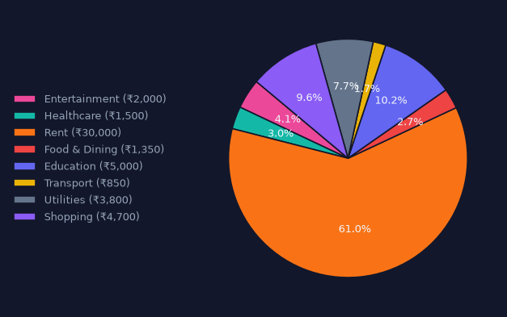
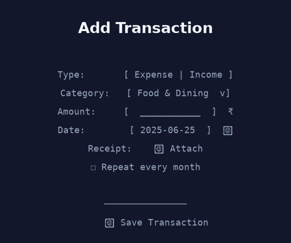
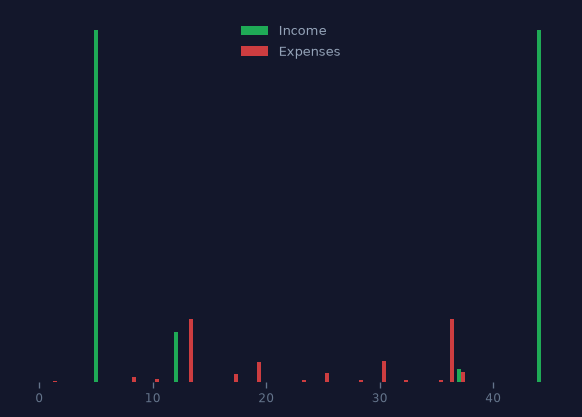

# FinSight — Budget Planner with Savings Goals

**A premium personal-finance desktop application** built with Python, CustomTkinter, and MySQL. Track income/expenses, manage savings goals, set monthly budgets, and export reports — all in a modern dark-themed UI.

---

## Features

- **Dashboard** — summary cards, pie chart (spending by category), bar chart (income vs expenses trend), recent transaction list with edit/delete
- **Add Transaction** — income/expense form with category, currency (INR/USD/NPR), amount, date picker, description, receipt image attach, recurring toggle
- **Savings Goals** — create targets with deadlines, add funds, track progress with bars, complete or cancel
- **Budget Planner** — set monthly spending limits per category, visual progress bars with over-budget warnings
- **Multi-Currency** — INR, USD, NPR with live conversion at dashboard render time; switch display currency freely
- **Export** — export transactions to Excel (.xlsx) or CSV for any date range
- **Recurring Transactions** — auto-insert monthly recurring bills on app startup
- **Remember Me** — optional auto-login via saved credentials
- **Keyboard Shortcuts** — `Ctrl+N` (Add), `Ctrl+D` (Dashboard), `Ctrl+G` (Goals), `Ctrl+B` (Budget)
- **Edit/Delete** — inline edit and delete on every transaction row

---

## Tech Stack

| Layer | Technology |
|-------|-----------|
| GUI | CustomTkinter 5.x (dark theme) |
| Charts | Matplotlib (Agg backend) |
| Database | MySQL 8.0 |
| Python | 3.13+ |
| Package mgr | uv |
| Testing | pytest |
| Export | pandas + openpyxl |

---

## Setup

### Prerequisites
- Python 3.13+
- [uv](https://docs.astral.sh/uv/) (Python package manager)
- MySQL 8.0 running on `localhost:3306`

### 1. Clone & enter the project
```bash
cd finsight
```

### 2. Create virtual env & install dependencies
```bash
uv venv
uv sync
```

### 3. Set up the database
```bash
# Set root password (PowerShell)
$env:FINSIGHT_DB_PASSWORD="your_mysql_root_password"

# Create the database and tables
uv run python -c "
import mysql.connector, os
conn = mysql.connector.connect(host='localhost', user='root', password=os.environ['FINSIGHT_DB_PASSWORD'])
cur = conn.cursor()
with open('database/schema.sql') as f:
    for stmt in f.read().split(';'):
        if stmt.strip(): cur.execute(stmt)
conn.commit()
cur.close()
conn.close()
print('Schema created')
"
```

### 4. Run migrations
```bash
uv run python -c "
import mysql.connector, os
conn = mysql.connector.connect(host='localhost', user='root',
    password=os.environ['FINSIGHT_DB_PASSWORD'], database='finsight')
cur = conn.cursor()
for m in ['database/migration_v2.sql', 'database/migration_v3.sql']:
    with open(m) as f:
        for stmt in f.read().split(';'):
            if stmt.strip():
                try: cur.execute(stmt)
                except mysql.connector.Error as e:
                    if 'already exists' not in str(e).lower(): print(f'Warning: {e}')
conn.commit(); cur.close(); conn.close()
print('Migrations done')
"
```

### 5. Launch
```bash
$env:FINSIGHT_DB_PASSWORD="your_mysql_root_password"
uv run python main.py
```

### Quick launch (single command)
```powershell
$env:FINSIGHT_DB_PASSWORD="your_password_here"; cd finsight; uv run python main.py
```

---

## Database Schema

```
users          (id, full_name, email, password_hash, preferred_currency)
categories     (id, user_id, name, type, icon, color)
transactions   (id, user_id, category_id, amount, type, currency, description, receipt_path, transaction_date)
savings_goals  (id, user_id, name, target_amount, current_amount, deadline, status)
budget_limits  (id, user_id, category_id, monthly_limit)
recurring_tx   (id, user_id, category_id, amount, type, currency, frequency, next_due_date)
```

---

## Tests
```bash
# Unit tests (no DB needed)
uv run pytest tests/test_currency.py tests/test_date_picker.py -v

# DB integration tests (requires FINSIGHT_DB_PASSWORD set)
uv run pytest tests/test_db_manager.py -v

# All tests
uv run pytest -v
```

---

## Keyboard Shortcuts

| Shortcut | Action |
|----------|--------|
| `Ctrl+D` | Dashboard |
| `Ctrl+N` | Add Transaction |
| `Ctrl+G` | Savings Goals |
| `Ctrl+B` | Budget Planner |

---

## Architecture
```
finsight/
├── main.py                  # App entry, sidebar, auth, shortcuts
├── pyproject.toml           # Project metadata & deps
├── docker-compose.yml       # MySQL + app containers
├── Dockerfile               # App container
├── database/
│   ├── schema.sql           # Initial schema (4 tables)
│   ├── migration_v2.sql     # Currency columns
│   └── migration_v3.sql     # Budgets, recurring, receipts
├── utils/
│   ├── db_manager.py        # All DB operations (CRUD)
│   ├── currency.py          # Conversion rates, formatting
│   ├── date_picker.py       # Calendar popup widget
│   ├── config_manager.py    # Credential persistence
│   ├── exporter.py          # CSV/Excel export
│   └── recurring.py         # Auto-process recurring txs
├── views/
│   ├── auth_view.py         # Login / Register
│   ├── dashboard_view.py    # Dashboard, charts, tx list
│   ├── add_transaction_view.py  # Transaction form
│   ├── goals_view.py        # Savings goals management
│   └── budget_view.py       # Budget Planner tab
├── tests/
│   ├── test_currency.py     # Currency conversion tests
│   ├── test_date_picker.py  # Date picker tests
│   └── test_db_manager.py   # DB integration tests
└── assets/
    └── finsight_theme.json  # Optional theme file
```

---

## Screenshots

| Dashboard | Add Transaction |
|-----------|----------------|
|  |  |

| Savings Goals | Budget Planner |
|---------------|----------------|
|  |  |

### Capture your own screenshots

```bash
# 1. Seed demo data
$env:FINSIGHT_DB_PASSWORD="your_password"
uv run python scripts/seed_demo.py

# 2. Launch the app and login with: demo@finsight.app / demo123
$env:FINSIGHT_DB_PASSWORD="your_password"
uv run python main.py

# 3. With the app open and logged in, run:
uv run python scripts/capture_screenshots.py
```
